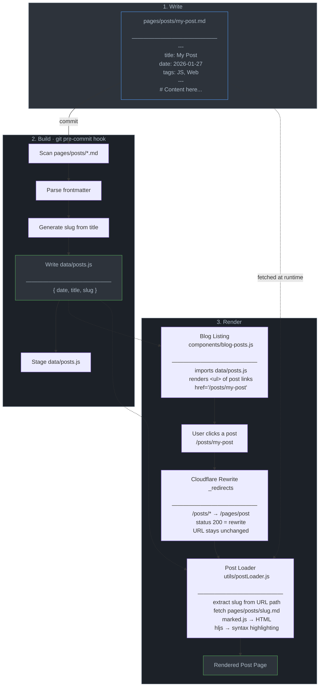

# Personal website

Welcome to my plain JS website!
This blog is built with plain JS using [Web Components API](https://developer.mozilla.org/en-US/docs/Web/API/Web_components), without any framworks

🌐 https://lylamin.com

Deployed on [Cloudflare Pages](https://pages.cloudflare.com/).

## How Blog Posts Work

## Reference

- https://modernfontstacks.com/
- https://plainvanillaweb.com/blog/
