# Personal website

Welcome to my vanilla JS website!
This blog is built with HTML, CSS, and JS using the [Web Components API](https://developer.mozilla.org/en-US/docs/Web/API/Web_components), without any frameworks

🌐 https://lylamin.com

Deployed on [Cloudflare Pages](https://pages.cloudflare.com/).

## How Blog Posts Work

```mermaid
flowchart TB
    subgraph Write["1. Write"]
        md["content/posts/my-post.md
        ―――――――――――――――
        ---
        title: My Post
        date: 2026-01-27
        tags: JS, Web
        ---
        # Content here..."]
    end

    subgraph Build["2. Build · npm run build"]
        scan[Scan content/posts/*.md]
        parse[Parse frontmatter]
        slug[Generate slug from title]
        render_md["markdown-it → HTML
        hljs → syntax highlighting"]
        write_html["Write posts/slug/index.html
        ―――――――――――――――
        Static HTML with
        styles, header, footer"]
        write_data["Write data/posts.js
        ―――――――――――――――
        { date, title, slug }"]
        scan --> parse --> slug --> render_md --> write_html
        render_md --> write_data
    end

    subgraph Serve["3. Serve"]
        direction TB
        list["Blog Listing
        components/blog-posts.js
        ―――――――――――――――
        imports data/posts.js
        renders &lt;ul&gt; of post links
        href='/posts/my-post'"]

        click_["User clicks a post
        /posts/my-post"]

        static["Static HTML
        posts/my-post/index.html
        ―――――――――――――――
        Pre-built at build time
        No runtime processing"]

        list --> click_ --> static
    end

    md -->|npm run build| scan
    write_data -.-> list
    write_html -.-> static

    style Write fill:#2d333b,stroke:#768390,color:#adbac7
    style Build fill:#1c2128,stroke:#768390,color:#adbac7
    style Serve fill:#1c2128,stroke:#768390,color:#adbac7
    style md fill:#2d333b,stroke:#539bf5,color:#adbac7
    style write_html fill:#2d333b,stroke:#57ab5a,color:#adbac7
    style write_data fill:#2d333b,stroke:#57ab5a,color:#adbac7
    style static fill:#2d333b,stroke:#57ab5a,color:#adbac7
```

## Reference

- https://modernfontstacks.com/
- https://plainvanillaweb.com/blog/
